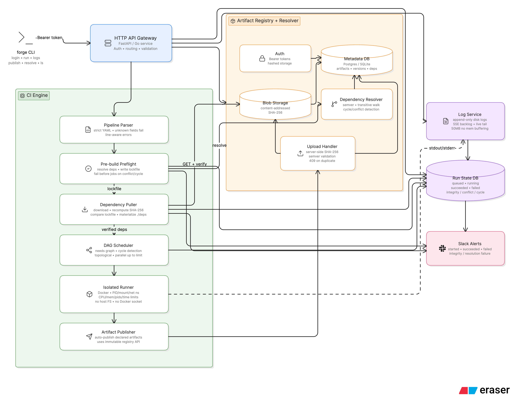
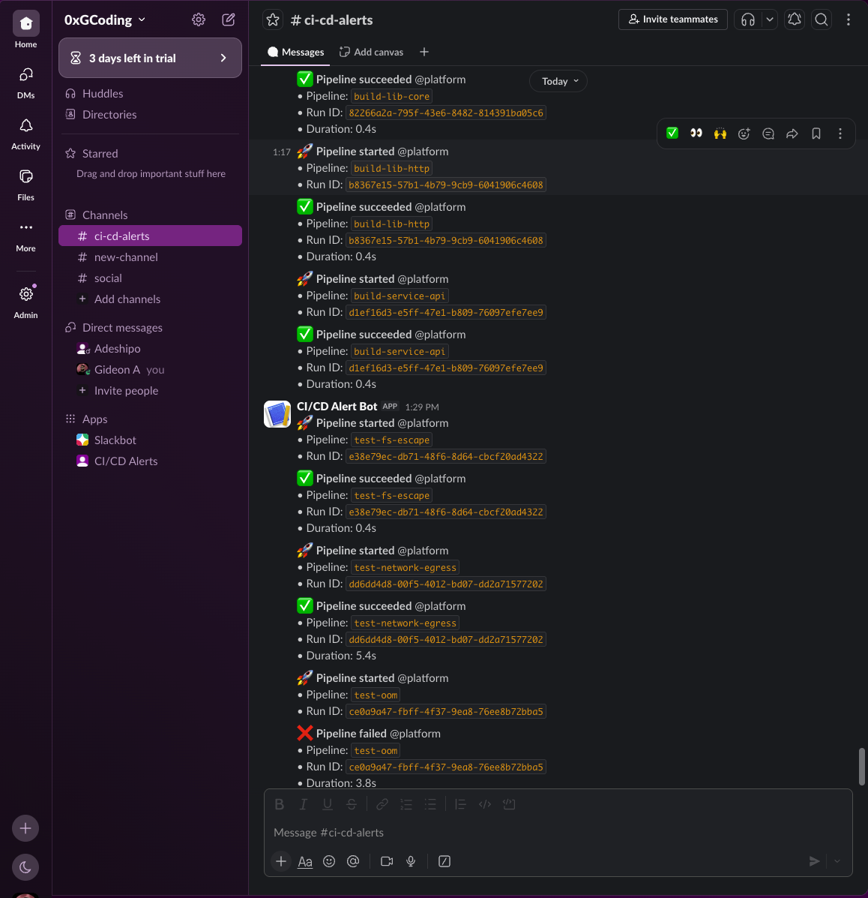

# Forge

Forge is a Python CI/CD platform with an integrated artifact registry and dependency resolver.

Public URL: `TODO`

## Architecture

Forge exposes one HTTP API. Internally it has two cooperating subsystems:

- `engine/`: pipeline parsing, pre-build resolution, DAG scheduling, isolated job execution, log streaming, run state.
- `registry/`: bearer-token auth, content-addressed artifact storage, immutable metadata, dependency resolution.



## Repository Structure

```text
engine/         # API gateway, parser, scheduler, runner, logs
registry/       # storage, metadata, resolver, auth
cli/forge.py    # pip-installable CLI
compose.yaml    # Docker Compose deployment
config.yaml     # runtime limits, paths, Slack webhook
requirements.txt
README.md
```

## Pipeline YAML Example

```yaml
name: build-lib-http
version: 1.0.0
dependencies:
  - name: lib-core
    version: "^1.0.0"
jobs:
  build:
    runtime: alpine:3.18
    resources: { cpu: 1.0, memory: 512Mi }
    steps:
      - { name: test, run: "sh ./test.sh" }
      - { name: package, run: "tar czf out.tar.gz src/" }
artifacts:
  - { name: lib-http, version: 1.0.0, path: ./out.tar.gz }
```

Validation rules:

- unknown fields fail
- missing required fields fail
- validation errors point to the offending line
- dependency resolution and lockfile creation happen before any job starts

## HTTP API Contract

All write operations require `Authorization: Bearer <token>`.

```text
POST /runs
GET  /runs/{id}
GET  /runs/{id}/lockfile
GET  /runs/{id}/logs?follow=true
POST /artifacts/{name}/{version}
GET  /artifacts/{name}/{version}
GET  /artifacts/{name}/{version}/meta
GET  /artifacts/{name}
```

Required statuses:

```text
queued, running, succeeded, failed, integrity_failure, conflict_failure, cycle_failure
```

## Implementation Notes

### Database Layer (`registry/db.py`)

All SQLite access goes through `registry/db.py` — no module calls `sqlite3.connect()` directly.

**WAL journal mode** — SQLite normally locks the entire database during writes. WAL (Write-Ahead Logging) allows reads and writes to happen concurrently. This matters because SSE log streaming (a read) must not be blocked by an artifact upload (a write) happening at the same time.

**Thread-local connections** — Flask handles each HTTP request in its own thread. Sharing a single SQLite connection across threads causes corruption. `threading.local()` gives each thread its own private connection automatically.

**`transaction()` context manager** — wraps any block of DB writes in BEGIN/COMMIT. If an exception is raised inside the block, it rolls back automatically. This guarantees no partial writes ever reach the database.

**`busy_timeout=5000`** — if two pipelines race to write simultaneously, SQLite waits up to 5 seconds before returning a locked error instead of failing instantly.

### Schema (`registry/init_db.py`)

Four tables make up the schema:

- **`artifacts`** — every published artifact. `UNIQUE(name, version)` enforces immutability at the database level. A second insert for the same coordinate raises `IntegrityError`, caught and returned as HTTP 409.
- **`tokens`** — bcrypt hashes of bearer tokens. Raw tokens are never stored.
- **`runs`** — one row per pipeline submission. Tracks status, raw YAML, resolved lockfile, and timing.
- **`jobs`** — one row per job within a run. Tracks dependencies (`needs`), status, log path, and start/finish times. Foreign key to `runs` with `ON DELETE CASCADE` so deleting a run cleans up all its jobs automatically.

The schema uses `CREATE TABLE IF NOT EXISTS` and `CREATE INDEX IF NOT EXISTS` throughout — making it safe to call on every startup without side effects.

### DAG Scheduler (`engine/scheduler.py`)

The scheduler builds a directed acyclic graph from `jobs.<job>.needs`, detects cycles before any job starts, topologically sorts the graph, and runs independent jobs in parallel up to the configured concurrency limit (`engine.max_concurrency` in `config.yaml`). A failed job marks all its dependents as `skipped` rather than `failed` — only the job that actually broke is blamed.

### Isolation (`engine/runner.py`)

Jobs run in Docker containers with:
- A dedicated workspace mount — the host filesystem is not visible
- PID, mount, and network namespaces — jobs cannot see or signal outside processes
- CPU and memory limits enforced from the pipeline YAML
- A wall-clock timeout (default 30 minutes, configurable)
- Dropped capabilities and no Docker socket mounted into job containers
- Network egress restricted to the Forge registry endpoint only — no public internet access

### Storage Layer (`registry/storage.py`)

Artifact blobs are content-addressed — stored on disk by their SHA-256 hash, not by name or version. The path structure is `data/blobs/<first-2-chars>/<full-sha256>`. The two-character prefix directory prevents any single directory from accumulating millions of files at scale.

**Upload flow** — the file streams to a temp path while SHA-256 is computed simultaneously. Only after the full file is written does the server compare the computed hash against the client-declared checksum. On mismatch the temp file is deleted and HTTP 400 is returned. On match the temp file is atomically moved to its permanent location.

**Deduplication** — if two different artifacts produce identical bytes, they share one blob on disk. The metadata table keeps the `(name, version) → sha256` mapping separate from the blob itself.

**Streaming reads** — `load_blob()` yields 256KB chunks. A 50MB artifact never loads fully into memory during a download.

**Racing duplicate publishes** — the `UNIQUE(name, version)` constraint in SQLite is the single serialisation point. Whichever of two concurrent uploads commits first wins; the second hits the constraint and gets HTTP 409. The blob may already be on disk from the losing upload but that is harmless — it is content-addressed and will be garbage-collected or reused.

### Resolver (`registry/resolver.py`)

The resolver walks registry metadata transitively from the declared dependencies in the pipeline YAML. It supports exact versions, caret (`^`), tilde (`~`), and comparator ranges (`>=1.0.0 <2.0.0`). It detects dependency cycles and version conflicts before returning, with error messages that name the cycle or show both conflicting constraint paths. The highest version satisfying all constraints is selected. The resulting lockfile contains exact versions and SHA-256 hashes. Given the same pipeline YAML and the same registry state, the resolver always produces an identical lockfile byte-for-byte.

### Log Streaming (`engine/logs.py`)

Each job gets its own append-only log file at `data/logs/<run_id>/<job_name>.log`. Lines are written with a UTC timestamp at write time.

SSE streaming works in two phases:

**Backlog replay** — when a client connects, the log file is read from the beginning in 256KB chunks and each line is formatted as an SSE event. A client connecting mid-build sees everything that already happened.

**Live tail** — with `follow=true`, after replaying the backlog the server seeks to the end of the file and waits on a `threading.Event`. When the runner writes a new line it sets the event, waking the SSE thread which reads and sends the new lines immediately. When the job finishes, `close_log()` removes the event — the SSE thread drains any remaining lines and closes the connection cleanly.

Large logs (50MB+) are never loaded into memory at any point in this pipeline.

### Auth (`registry/auth.py`)

`create_token()` generates a 64-character random hex string, hashes it with bcrypt, stores only the hash, and returns the raw token once. After that the raw token cannot be recovered.

`verify_token()` runs `bcrypt.checkpw()` against every stored hash. Bcrypt is intentionally slow — this is what makes brute-force attacks impractical even if the token table is leaked.

All write endpoints call `require_auth()` which parses the `Authorization: Bearer <token>` header and raises `AuthError` on any problem — missing header, wrong format, or invalid token.

### Slack Alerts

Slack webhook URL is configured in `config.yaml`.

Required events:

- pipeline started
- pipeline succeeded
- pipeline failed (with failing job name)
- integrity failure (with expected and actual SHA-256, run ID)
- resolution failure (with conflict or cycle details)

Screenshot: `TODO`

## Fresh VPS Setup

```bash
git clone https://github.com/GideonIsBuilding/forge.git forge
cd forge
cp config.yaml config.prod.yaml
docker compose up -d --build
docker compose exec forge-api python -c "
from registry import db, auth
from registry.init_db import create_schema
db.init('data/forge.db')
create_schema()
token = auth.create_token('admin')
print('Token:', token)"
```

Then run:

```bash
forge login http://<server-ip>:8080
forge run examples/lib-core.yaml
```



## Required Capability Checklist

- [ ] pipeline builds and publishes `lib-core@1.0.0`
- [ ] pipeline resolves `lib-core@^1.0.0` and publishes `lib-http@1.0.0`
- [ ] pipeline resolves both and publishes `service-api@0.1.0`
- [ ] wrong checksum upload returns `400`
- [ ] duplicate upload returns `409`
- [ ] version conflict fails before build
- [ ] filesystem escape, memory exhaustion, and non-registry egress are contained
- [ ] 50MB logs stream live without buffering
